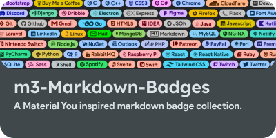
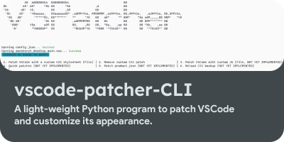

  

  
  
  
  
  
  
  
  
  
  
  
  
  
  
  
  
  
  
  
  
  
  
  
  
  
  

<a href="https://ziadoua.github.io/">
  <picture>
    <source media="(prefers-color-scheme: dark)" srcset="res/portfolioButtonDark.png">
    <source media="(prefers-color-scheme: light)" srcset="res/portfolioButtonLight.png">
    
  </picture>
</a>

 

  <a href="https://github.com/ziadOUA/m3-Markdown-Badges">
    <picture>
      <source media="(prefers-color-scheme: dark)" srcset="res/repository1Dark.png">
      <source media="(prefers-color-scheme: light)" srcset="res/repository1Light.png">
      
    </picture>
  </a>
  
  
  <a href="https://github.com/ziadOUA/vscode-patcher-CLI">
    <picture>
      <source media="(prefers-color-scheme: dark)" srcset="res/repository2Dark.png">
      <source media="(prefers-color-scheme: light)" srcset="res/repository2Light.png">
      
    </picture>
  </a>

  
    
<picture>
  <source media="(prefers-color-scheme: dark)" srcset="https://github.com/ziadOUA/ziadOUA/blob/output/github-contribution-grid-snake-dark.svg">
  <source media="(prefers-color-scheme: light)" srcset="https://github.com/ziadOUA/ziadOUA/blob/output/github-contribution-grid-snake.svg">
  
</picture>
  

*You can find theses badges here : <a href="https://github.com/ziadOUA/m3-Markdown-Badges">ziadOUA/m3-Markdown-Badges</a>*

*Thanks for [Pawel Czerwinski](https://unsplash.com/fr/@pawel_czerwinski)'s wallpapers and [Pangram Pangram](https://pangrampangram.com/)'s fonts*

