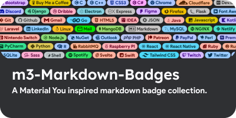
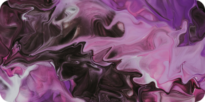

    
<!--    -->
    
  
    

  
  
  
  
  
  
  
  
  
  
  
    
  
  
  
  
  
  
  
  
  
  
  

 

  <a href="https://github.com/ziadOUA/m3-Markdown-Badges">
    <picture>
      <source media="(prefers-color-scheme: dark)" srcset="res/repo1.png">
      <source media="(prefers-color-scheme: light)" srcset="res/repo1light.png">
      
    </picture>
  </a>
  
  
  <a href="https://github.com/ziadOUA/vscode-patcher-CLI">
    <picture>
      <source media="(prefers-color-scheme: dark)" srcset="res/repo2.png">
      <source media="(prefers-color-scheme: light)" srcset="res/repo2light.png">
      
    </picture>
  </a>

  
  

*You can find theses badges here : <a href="https://github.com/ziadOUA/m3-Markdown-Badges">ziadOUA/m3-Markdown-Badges</a>*

